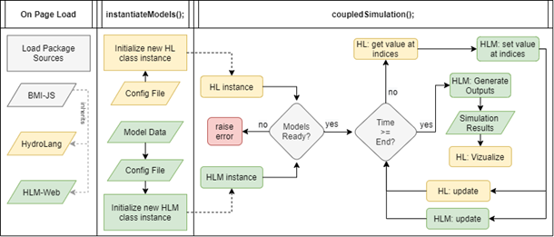

# Clear Creek Coupled Model
This subdir contains a case study of coupling HLM-Web with HydroLang via the BMI specification.
Coupling was performed to link web-hosted precipitation products with the HLM-Web rainfall-runoff model.

## Usage
To replicate the coupled simulation: 
- download the repo (and the BMI-compliant HLM-Web)
- open `coupled.html` and open the browser's console.
- call `instantiateModels();`
- **Wait**... data is being retrieved and prepared for the simulation.
- Click "OK" in pop up window.
- start the simulation by calling `coupledSimulation();`



## References

Further information about this project can be found in our [pre-print article](https://doi.org/10.31223/X5XP93)

```
Client-side Web-based Model Coupling using Basic Model Interface for Hydrology and Water Resources
Gregory J. Ewing, Carlos Erazo Ramirez, Ashani Vaidya, Ibrahim Demir
https://doi.org/10.31223/X5XP93
[Pre-print] Submitted as Technical Note to Journal of HydroInformatics.
```
